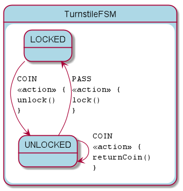

= KFSM Turnstile Sample for Spring HATEOAS

A simple application to demonstrate implementing link:https://github.com/open-jumpco/kfsm[KFSM] with the classic Turnstile FSM.

[source,bash]
----
./gradlew bootRun
----

== Description

When designing a FSM careful consideration of how the state is externalised is important.
It is advisable that the type used to represent the state in the definition also be the type persisted by the domain entity or at least
 providing a consistent bi-directional conversion.

In the Turnstile example we are only concerned with 2 states so a `Boolean` is an acceptible standin.

The FSM definition uses `TurnstileContext` to represent the operations and determine the current state.

The domain class `TurnstileData` is a representation of the state of the Turnstile for external use and is return from the event.

[source,kotlin]
----
data class TurnstileData(
    val id: Long,
    val locked: Boolean,
    val message: String
) {
    val currentState: TurnstileState
        get() = if (locked) LOCKED else UNLOCKED
}

interface TurnstileContext {
    val currentState: TurnstileState
    fun alarm(): TurnstileData?
    fun lock(): TurnstileData?
    fun unlock(): TurnstileData?
    fun returnCoin(): TurnstileData?
}
----

We extend the `TurnstileContext` to create a persistent context using 
link:https://spring.io/projects/spring-data-jdbc[Spring Data JDBC]

[source,kotlin]
----
@ResponseStatus(CONFLICT)
class TurnstileAlarmException(message: String) : Exception(message)

@ResponseStatus(NOT_FOUND)
class TurnstileInfoNotFound(message: String) : Exception(message)

@Table("TURNSTILE_INFO")
data class TurnstileEntity(
    @Id var id: Long? = null,
    @Column("LOCKED_B")
    val locked: Boolean = true,
    @Column("MESSAGE_S")
    val message: String = ""
) {
    fun update(locked: Boolean? = null, message: String? = null) =
        copy(locked = locked ?: this.locked, message = message ?: "")

    fun toInfo() = TurnstileData(id!!, locked, message)
}

interface TurnstileRepository : CrudRepository<TurnstileEntity, Long>

class TurnstilePersistentContext(private val turnstileRepository: TurnstileRepository, id: Long) : TurnstileContext {
    val turnstileInfo: TurnstileEntity

    init {
        turnstileInfo =
            turnstileRepository.findById(id).orElseThrow { TurnstileInfoNotFound("TurnstileEntity $id not found") }
    }

    override val currentState: TurnstileState
        get() = if (turnstileInfo.locked) LOCKED else UNLOCKED

    override fun alarm(): TurnstileData? {
        throw TurnstileAlarmException("Alarm")
    }

    override fun lock(): TurnstileData? {
        return turnstileRepository.save(turnstileInfo.update(locked = true)).toInfo()
    }

    override fun unlock(): TurnstileData? {
        return turnstileRepository.save(turnstileInfo.update(locked = false)).toInfo()
    }

    override fun returnCoin(): TurnstileData? {
        return turnstileRepository.save(turnstileInfo.update(message = "Return Coin")).toInfo()
    }
}
----

== Operations

We start by creating some turnstile entities:

=== ApiList
[source,bash]
----
http http://localhost:8080/
----

=== Create
[source,bash]
----
http POST http://localhost:8080/turnsile/
----

Should return:
[source,json]
----
{
    "_links": {
        "coin": {
            "href": "http://localhost:8080/turnsile/1/coin"
        },
        "self": {
            "href": "http://localhost:8080/turnsile/1"
        }
    },
    "currentState": "LOCKED",
    "id": 1,
    "locked": true,
    "message": ""
}
----

After calling is 5 times we can list the turnstiles

=== List
[source,bash]
----
http http://localhost:8080/turnsile/
----

Should return:
[source,json]
----
{
    "_embedded": {
        "turnstileInfoList": [
            {
                "_links": {
                    "coin": {
                        "href": "http://localhost:8080/turnsile/1/coin"
                    },
                    "self": {
                        "href": "http://localhost:8080/turnsile/1"
                    }
                },
                "id": 1,
                "locked": true,
                "message": ""
            },
            {
                "_links": {
                    "coin": {
                        "href": "http://localhost:8080/turnsile/2/coin"
                    },
                    "self": {
                        "href": "http://localhost:8080/turnsile/2"
                    }
                },
                "id": 2,
                "locked": true,
                "message": ""
            },
            {
                "_links": {
                    "coin": {
                        "href": "http://localhost:8080/turnsile/3/coin"
                    },
                    "self": {
                        "href": "http://localhost:8080/turnsile/3"
                    }
                },
                "id": 3,
                "locked": true,
                "message": ""
            },
            {
                "_links": {
                    "coin": {
                        "href": "http://localhost:8080/turnsile/4/coin"
                    },
                    "self": {
                        "href": "http://localhost:8080/turnsile/4"
                    }
                },
                "id": 4,
                "locked": true,
                "message": ""
            },
            {
                "_links": {
                    "coin": {
                        "href": "http://localhost:8080/turnsile/5/coin"
                    },
                    "self": {
                        "href": "http://localhost:8080/turnsile/5"
                    }
                },
                "id": 5,
                "locked": true,
                "message": ""
            }
        ]
    },
    "_links": {
        "self": {
            "href": "http://localhost:8080/turnsile/"
        }
    }
}
----

=== Read
[source,bash]
----
http http://localhost:8080/turnsile/1
----

Returns:
[source,json]
----
{
    "_links": {
        "coin": {
            "href": "http://localhost:8080/turnsile/1/coin"
        },
        "self": {
            "href": "http://localhost:8080/turnsile/1"
        }
    },
    "id": 1,
    "locked": true,
    "message": ""
}
----

=== Coin
[source,bash]
----
http POST http://localhost:8080/turnsile/1/coin
----

Should return:
[source,json]
----
{
    "_links": {
        "coin": {
            "href": "http://localhost:8080/turnsile/1/coin"
        },
        "pass": {
            "href": "http://localhost:8080/turnsile/1/pass"
        },
        "self": {
            "href": "http://localhost:8080/turnsile/1"
        }
    },
    "id": 1,
    "locked": false,
    "message": ""
}
----

=== Pass
[source,bash]
----
http POST http://localhost:8080/turnsile/1/pass
----

Should return:
[source,json]
----
{
    "_links": {
        "coin": {
            "href": "http://localhost:8080/turnsile/1/coin"
        },
        "self": {
            "href": "http://localhost:8080/turnsile/1"
        }
    },
    "id": 1,
    "locked": true,
    "message": ""
}
----

=== Invalid pass event
[source,bash]
----
http POST http://localhost:8080/turnsile/1/pass
----

The system throws `TurnstileAlarmException` which results in 409 - Conflict

[source,json]
----
{
    "error": "Conflict",
    "message": "Alarm",
    "path": "/1/pass",
    "status": 409,
    "timestamp": "2020-01-30T21:06:05.491+0000",
    "trace": "com.example.kfsm.TurnstileAlarmException: Alarm\r\n\tat com.example.kfsm.TurnstileFSM$Companion$definition$1$2$1.invoke(Turnstile.kt:49)\r\n\tat com.example.kfsm.TurnstileFSM$Companion$definition$1$2$1.invoke(Turnstile.kt:38)\r\n\tat io.jumpco.open.kfsm.StateMapInstance.executeDefaultAction(StateMapInstance.kt:61)\r\n\tat io.jumpco.open.kfsm.StateMapInstance.sendEvent(StateMapInstance.kt:85)\r\n\tat io.jumpco.open.kfsm.StateMachineInstance.sendEvent(StateMachineInstance.kt:152)\r\n\tat com.example.kfsm.TurnstileFSM.pass(Turnstile.kt:35)\r\n\tat com.example.kfsm.TurnstileController.pass(TurnstileController.kt:92)\r\n\tat sun.reflect.NativeMethodAccessorImpl.invoke0(Native Method)\r\n\tat sun.reflect.NativeMethodAccessorImpl.invoke(NativeMethodAccessorImpl.java:62)\r\n\tat sun.reflect.DelegatingMethodAccessorImpl.invoke(DelegatingMethodAccessorImpl.java:43)\r\n\tat java.lang.reflect.Method.invoke(Method.java:498)\r\n\tat org.springframework.web.method.support.InvocableHandlerMethod.doInvoke(InvocableHandlerMethod.java:190)\r\n\tat org.springframework.web.method.support.InvocableHandlerMethod.invokeForRequest(InvocableHandlerMethod.java:138)\r\n\tat org.springframework.web.servlet.mvc.method.annotation.ServletInvocableHandlerMethod.invokeAndHandle(ServletInvocableHandlerMethod.java:106)\r\n\tat org.springframework.web.servlet.mvc.method.annotation.RequestMappingHandlerAdapter.invokeHandlerMethod(RequestMappingHandlerAdapter.java:888)\r\n\tat org.springframework.web.servlet.mvc.method.annotation.RequestMappingHandlerAdapter.handleInternal(RequestMappingHandlerAdapter.java:793)\r\n\tat org.springframework.web.servlet.mvc.method.AbstractHandlerMethodAdapter.handle(AbstractHandlerMethodAdapter.java:87)\r\n\tat org.springframework.web.servlet.DispatcherServlet.doDispatch(DispatcherServlet.java:1040)\r\n\tat org.springframework.web.servlet.DispatcherServlet.doService(DispatcherServlet.java:943)\r\n\tat org.springframework.web.servlet.FrameworkServlet.processRequest(FrameworkServlet.java:1006)\r\n\tat org.springframework.web.servlet.FrameworkServlet.doPost(FrameworkServlet.java:909)\r\n\tat javax.servlet.http.HttpServlet.service(HttpServlet.java:660)\r\n\tat org.springframework.web.servlet.FrameworkServlet.service(FrameworkServlet.java:883)\r\n\tat javax.servlet.http.HttpServlet.service(HttpServlet.java:741)\r\n\tat org.apache.catalina.core.ApplicationFilterChain.internalDoFilter(ApplicationFilterChain.java:231)\r\n\tat org.apache.catalina.core.ApplicationFilterChain.doFilter(ApplicationFilterChain.java:166)\r\n\tat org.apache.tomcat.websocket.server.WsFilter.doFilter(WsFilter.java:53)\r\n\tat org.apache.catalina.core.ApplicationFilterChain.internalDoFilter(ApplicationFilterChain.java:193)\r\n\tat org.apache.catalina.core.ApplicationFilterChain.doFilter(ApplicationFilterChain.java:166)\r\n\tat org.springframework.web.filter.RequestContextFilter.doFilterInternal(RequestContextFilter.java:100)\r\n\tat org.springframework.web.filter.OncePerRequestFilter.doFilter(OncePerRequestFilter.java:119)\r\n\tat org.apache.catalina.core.ApplicationFilterChain.internalDoFilter(ApplicationFilterChain.java:193)\r\n\tat org.apache.catalina.core.ApplicationFilterChain.doFilter(ApplicationFilterChain.java:166)\r\n\tat org.springframework.web.filter.FormContentFilter.doFilterInternal(FormContentFilter.java:93)\r\n\tat org.springframework.web.filter.OncePerRequestFilter.doFilter(OncePerRequestFilter.java:119)\r\n\tat org.apache.catalina.core.ApplicationFilterChain.internalDoFilter(ApplicationFilterChain.java:193)\r\n\tat org.apache.catalina.core.ApplicationFilterChain.doFilter(ApplicationFilterChain.java:166)\r\n\tat org.springframework.web.filter.CharacterEncodingFilter.doFilterInternal(CharacterEncodingFilter.java:201)\r\n\tat org.springframework.web.filter.OncePerRequestFilter.doFilter(OncePerRequestFilter.java:119)\r\n\tat org.apache.catalina.core.ApplicationFilterChain.internalDoFilter(ApplicationFilterChain.java:193)\r\n\tat org.apache.catalina.core.ApplicationFilterChain.doFilter(ApplicationFilterChain.java:166)\r\n\tat org.apache.catalina.core.StandardWrapperValve.invoke(StandardWrapperValve.java:202)\r\n\tat org.apache.catalina.core.StandardContextValve.invoke(StandardContextValve.java:96)\r\n\tat org.apache.catalina.authenticator.AuthenticatorBase.invoke(AuthenticatorBase.java:541)\r\n\tat org.apache.catalina.core.StandardHostValve.invoke(StandardHostValve.java:139)\r\n\tat org.apache.catalina.valves.ErrorReportValve.invoke(ErrorReportValve.java:92)\r\n\tat org.apache.catalina.core.StandardEngineValve.invoke(StandardEngineValve.java:74)\r\n\tat org.apache.catalina.connector.CoyoteAdapter.service(CoyoteAdapter.java:343)\r\n\tat org.apache.coyote.http11.Http11Processor.service(Http11Processor.java:367)\r\n\tat org.apache.coyote.AbstractProcessorLight.process(AbstractProcessorLight.java:65)\r\n\tat org.apache.coyote.AbstractProtocol$ConnectionHandler.process(AbstractProtocol.java:860)\r\n\tat org.apache.tomcat.util.net.NioEndpoint$SocketProcessor.doRun(NioEndpoint.java:1598)\r\n\tat org.apache.tomcat.util.net.SocketProcessorBase.run(SocketProcessorBase.java:49)\r\n\tat java.util.concurrent.ThreadPoolExecutor.runWorker(ThreadPoolExecutor.java:1149)\r\n\tat java.util.concurrent.ThreadPoolExecutor$Worker.run(ThreadPoolExecutor.java:624)\r\n\tat org.apache.tomcat.util.threads.TaskThread$WrappingRunnable.run(TaskThread.java:61)\r\n\tat java.lang.Thread.run(Thread.java:748)\r\n"
}
----

=== Coin when unlocked
[source,bash]
----
http POST http://localhost:8080/turnsile/1/coin 
----
Should return:
[source,json]
----
{
    "_links": {
        "coin": {
            "href": "http://localhost:8080/turnsile/1/coin"
        },
        "pass": {
            "href": "http://localhost:8080/turnsile/1/pass"
        },
        "self": {
            "href": "http://localhost:8080/turnsile/1"
        }
    },
    "id": 1,
    "locked": false,
    "message": "Return Coin"
}
----

== Generated State Table

=== TurnstileFSM State Map

|===
| Start | Event[Guard] | Target | Action

| LOCKED
| COIN
| UNLOCKED
a| [source,kotlin]
----
{
unlock()
}
----

| UNLOCKED
| PASS
| LOCKED
a| [source,kotlin]
----
{
lock()
}
----

| UNLOCKED
| COIN
| UNLOCKED
a| [source,kotlin]
----
{
returnCoin()
}
----
|===

== Generated State Diagram

To learn more about visualization visit link:https://github.com/open-jumpco/kfsm-viz[kfsm-viz] and
link:https://github.com/open-jumpco/kfsm-viz-plugin[kfsm-viz-plugin]

